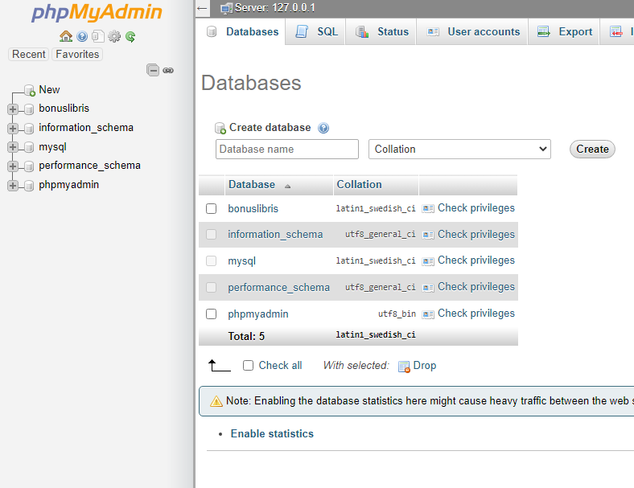
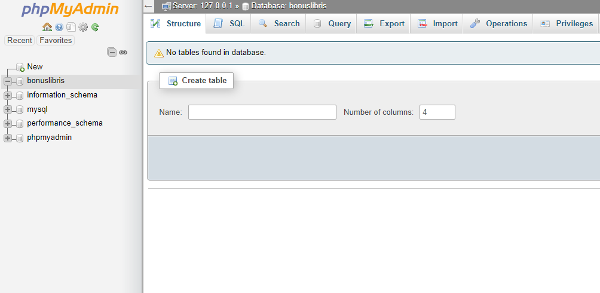
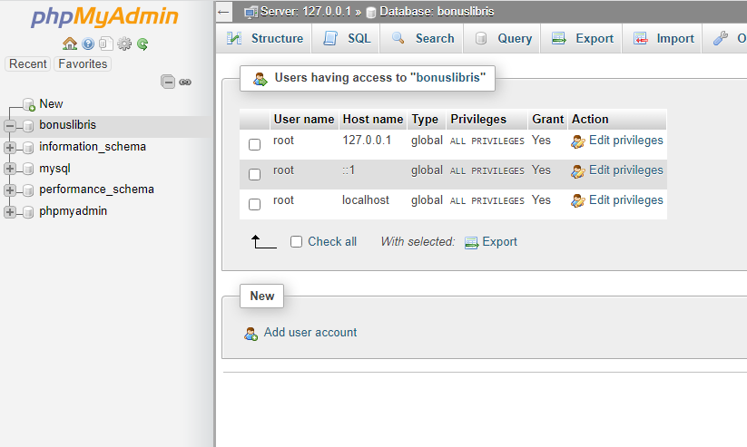
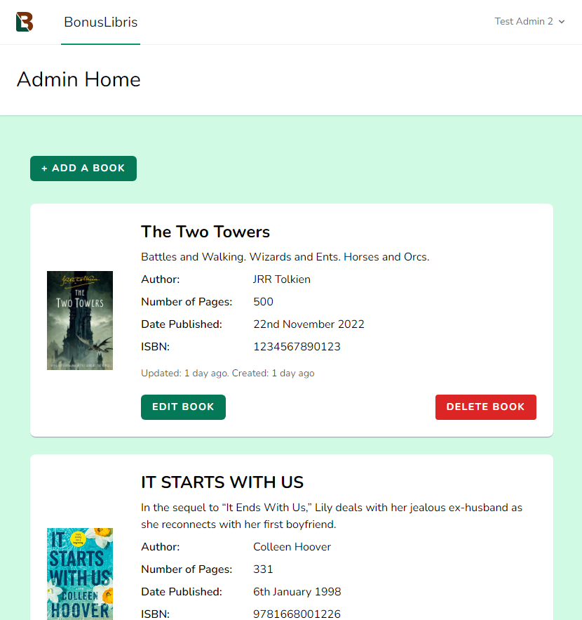
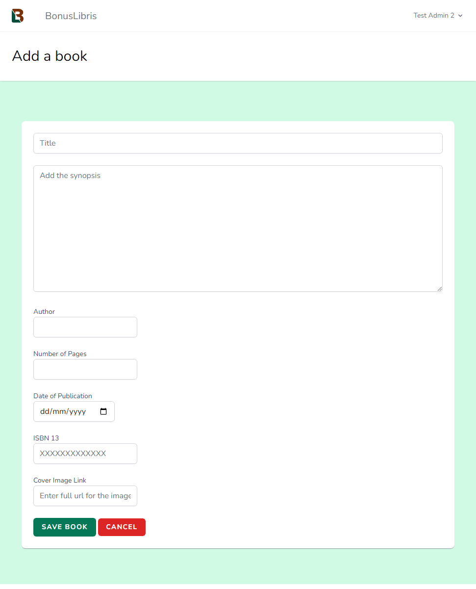

<a name="readme-top"></a>

# BonusLibris

![BonusLibris visitor screen][bonuslibris-screenshot]

BonusLibris is a web application aimed at book lovers, offering access to information for a wide range of fiction books.

BonusLibris will offer visitors the opportunity to search / filter the book list, then review books with comments, star-ratings and likes/dislikes. 

Currently the ADMIN features are implemented.
## Features
### Current feature list
- Visitors get a paginated grid of books including cover image, description and author.
- ADMIN or USER level accounts
- LOGIN or REGISTER.
- Visitors can register for an account. New user accounts default to USER access level.
- ADMIN accounts:
    - view a list of books
    - view individual book details
    - edit book details
    - update book details
    - delete a book
### Future feature list
- Add book genre / format
- Book cover mages stored locally as an option
- Links to books on Amazon (affiliate)
- Admin dashboard to replace the book list:
    - manage books
    - manage visitors
    - manage comments/reviews

- User / visitor accounts:
    - filter books by genre and format
    - find books by search string
    - view individual books
    - add comments, reviews and ratings for books
    - edit own comments
    - "like" comments from other reviews
<p align="right">(<a href="#readme-top">back to top</a>)</p>

## Built With


 [![Laravel][Laravel.com]][Laravel-url]
 [![Tailwindcss][Tailwindcss.com]][Tailwindcss-url]
 [![MySQL][MySQL.com]][MySQL-url]

<p align="right">(<a href="#readme-top">back to top</a>)</p>

## Getting Started

### Prerequisites
**Windows**: 

- [XAMPP installed and working][xampp-installation-url].
(Other operating systems and environments are supported. See specific documentation for setup of web server in these.)

- A code editor - [Visual Studio Code][vscode-url]

### Installation

#### Setting Up On Windows

1. Download and install [Node.js][Nodejs-url]

1. Create a [GitHub account][GitHub-url]

1. Download and install [Git][git-url] to the root of the hard drive.

1. Setup the Git environment:

    1.   Start a Command Prompt (cmd) and run git-bash 
    ```
    \git\git-bash
    ```
    2.  In git-bash: 
    ```
    git config --global core.autocrlf true
    git config --global user.email "youremail@company.com"
    git config --global user.name "Your Name"
    ```


1. From the XAMPP directory, launch the XAMPP Control Panel (\xampp\xampp-control.exe).
![XAMPP Control Panel][xampp-control-screenshot]

1. Click "Start" for Apache and MySQL and check that both run correctly.

1. In the Control Panel launch a command window by clicking the "Shell" button from the right of the panel. Create the .bat file if prompted.

1.  Enter the following in the terminal window:
    
    ```
    php -r "copy('https://getcomposer.org/installer', 'composer-setup.php');"

    php -r "if (hash_file('sha384', 'composer-setup.php') === '55ce33d7678c5a611085589f1f3ddf8b3c52d662cd01d4ba        75c0ee0459970c2200a51f492d557530c71c15d8dba01eae') { echo 'Installer verified'; } else { echo 'Installer corrupt'; unlink('composer-setup.php'); } echo PHP_EOL;"
    
    php composer-setup.php
    php -r "unlink('composer-setup.php');"
    ```
    Enter this command in the terminla to give the Composer management panel:

    ```
    php composer.phar
    ```

#### Create a New MySQL Database

1.  Check that the MySQL service is running in XAMPP.

1.  Click the MySQL 'Admin' button (or in a browser window go to 'localhost/phpmyadmin'), this is a management page for MySQL databases.

    ![PHPMyAdmin Dashboard][phpmyadmin-screenshot]

3. Create a new database by clicking 'New' in the left-hand panel.

    Database name: *bonuslibris*

    <p align="center"> </p>

4.  Click on the *bonuslibris* database and select 'Priviliges' from the tabs along the top.
    
    <p align="center"> </p>

5.  Create a new user by clicking 'Add user account':
    <p align="center"> </p>
    
    ```
    User name: bonuslibris    
    Host name: leave blank
    Password: 4Security1 (or your choice of strong password)
    ```
    
    **Make a note of these details, you will need them later**

    Grant all priviliges on database "bonuslibris" and click "Go".

#### Get Ready For Laravel

1.  In XAMPP Control, click the "Shell" button and run the Git terminal (git-bash) by entering the command:

    ```
    \git\git-bash
    ```
    ------------------------
    **Note:**
    The above works if Git is in the root directory of the drive on which XAMPP is installed.
    
    The other options might be:

    - *d:\git\git-bash* (Where Git is installed on another drive - D in this case)

    - *git-bash* (Where Git is installed and has been added to the Windows environment variable)
    
    For the sake of this process we will use the *\git\git-bash*
    
    ---------------
    
2.  Make a new directory in your XAMPP '*htdocs*' directory and change into the 'bonuslibris' directory:

    ```
    mkdir htdocs/bonuslibris
    cd htdocs/bonuslibris
    ```

3.  Open this folder in Visual Studio Code (you will use this soon) :

    ```
    vscode .
    ```

    *Don't miss the full stop/period*

#### Install Laravel

1.  Using the git-bash terminal in the `*bonuslibris*` directory install Laravel using Composer:

    ```
    ../../composer.phar create-project laravel/laravel .
    ```

    *Don't miss the full stop/period*
    
    Wait fo rhte process to complete (this may take several minutes).

2.  Once the process is complete, stop the Apache service in XAMPP Control Panel and click the Apache Config button. This will option the Apache options file - `httpd.conf`

    Search httpd.conf (CTRL-F) for `DocumentRoot`
    Find the two lines in the `httpd.conf`:
    ```
    DocumentRoot "/xampp/htdocs/"
    <Directory "/xampp/htdocs/">
    ```
    and add ```bonuslibris/public``` to the end of each, giving:

    ```
    DocumentRoot "/xampp/htdocs/bonuslibris/public"
    <Directory "/xampp/htdocs/bonuslibris/public">
    ```
    This is the location that Laravel puts the build of the app and will be the location of what the visitor to the site sees on screen.

    Save the file and restart Apache.

1.  Visit "http://localhost" in a browser to see the Laravel home page.

#### Configure the Database in Laravel

1.  In VSCode open the ```.env``` file from the left hand panel. make these changes to match the database details you set up earlier:

```
DB_CONNECTION=mysql
DB_HOST=127.0.0.1
DB_PORT=3306
DB_DATABASE=bonuslibris
DB_USERNAME=bonuslibris
DB_PASSWORD=4Security1                  (*your password)

```

#### Install Breeze and Tailwind

Breeze is a Laravel Starter kit, which handles authentication.

Tailwind CSS is a utility-based css framework used in styling the pages.

In the git-bash terminal enter:

```
php artisan breeze:install
 
php artisan migrate
npm install
```

#### Clone the BonusLibris Github Repository

Clone the repository for Github by issuing the following command in the git-bash terminal 

```
git clone https://github.com/hudds-awp-cht2520/assignment-01-orcwarlord.git .
```
**Don't miss the full stop / period**

The command will make a copy of the files in the bonuslibris folder.

#### Create the Tables and Seed 

 The following command will:
 
 - create all of the tables needed for BonusLibris
 - create sample data for books using the NY Times bestseller lists
 - create sample user accounts - admin and user levels

 In git-bash enter:

 ```
 php artisan migrate:fresh --seed
 ```
 This runs the migrations (sets up the tables) and populates the database with data (seeds).

 #### View the site

 1. Start Node.js watching the project. In git-bash enter:
    ```
    npm run dev
    ```
 
 1. In a browser visit ```http://localhost```. The homepage is the vistor view of BonusLibris.

    ![BonusLibris visitor screen][bonuslibris-screenshot]

 ## Using BonusLibris

 ### Admin

 1. On the BonusLibris homepage click the Login button and sign in using:
    ```
    Email:     testadmin1@testadmin.com
    Password:  password
    ```
    
    <p align="center"> </p>

    1.  Forgotten passwords can be reset from here
#### Dashboard
The Admin dashboard lists all of the books in the database starting with the most recently created. 
    <p align="center"> </p>
Options from here:

1.  Viewing a book's details
1.  Add a Book
1.  Edit a Book
1.  Delete a Book  
#### Details
Details of each book can be viewed by clicking the title or image, opening the book's details page.
    <p align="center"> </p>
    Books can edited or deleted from here.
#### Adding a Book
1.  Books can be added by selecting ```Add a Book```
    <p align="center"> </p>

    | Field                 | Description            | Required |
    | -----------           | ---------------------- | - |
    | Title                 | Book title             | Yes |
    | Synopsis              | Description of the book, 200 characters shown on the home page        | Yes |
    | Author                | Author name            | No |
    | Number of Pages       | Whole positive number  | No |
    | Date of publication   | Date, select from calendar or enter in UK format       | Yes |
    | ISBN     | 13 character ISBN                   | No |
    | Cover Image Link     | Fully qualified URL     | No |

2.  Book is added with the current user's id.

Required fields must completed and other fields are validated for consistency.

#### Book Details
1.  Book details are updated by choosing ```Edit Book``` which loads a page that allows values to be changed.
1.  Existing details are loaded from the database.
1.  Entry and validation are as `Add a Book` 
1.  Save or Cancel

#### Delete a Book
1.  Permanent deletion.
1.  User asked for confirmation.
    <p align="center"> </p>


#### Logout
Logging out (dropdown menu under username) returns to the visitor homepage.

#### Register User
<p align="center"> </p>

-   Vistors can sign up to BonusLibris at User level.
-   Name can be a duplicate of other users however email address must be unique.
-   Passwords must match 

## References

Balasa, S. (2022). Laravel 9.0 Essential Training. Linkedin Learning. https://www.linkedin.com/learning/laravel-9-0-essential-training/
	
Castelo, A. (2017). Laravel API Tutorial: How to Build and Test a RESTful API. TopTal. Retrieved 27/10/2022 from https://www.toptal.com/laravel/restful-laravel-api-tutorial
	
Install Tailwind CSS with Laravel. (2022).  Tailwind CSS. Retrieved 14/10/2022 from https://tailwindcss.com/docs/guides/laravel
	
Laravel Breeze. (2022).  Laravel. https://laravel.com/docs/9.x/starter-kits#laravel-breeze
	


[xampp-installation-url]: https://www.apachefriends.org/
[MySQL.com]: https://img.shields.io/badge/MySQL-00000F?style=for-the-badge&logo=mysql&logoColor=white
[MySQL-url]: https://www.mysql.com/
[Laravel.com]: https://img.shields.io/badge/Laravel-FF2D20?style=for-the-badge&logo=laravel&logoColor=white
[Laravel-url]: https://laravel.com 
[Tailwindcss.com]: https://img.shields.io/badge/Tailwind_CSS-38B2AC?style=for-the-badge&logo=tailwind-css&logoColor=white
[Tailwindcss-url]: https://tailwindcss.com
[Nodejs-url]: https://nodejs.org/en/download/
[GitHub-url]: https://github.com
[git-url]: https://git-scm.com/download/win
[vscode-url]: https://code.visualstudio.com/download

[bonuslibris-screenshot]: readme_assets/bl-front.png
[xampp-control-screenshot]: readme_assets/xampp-control.png
[phpmyadmin-screenshot]: readme_assets/phpmyadmin.png

