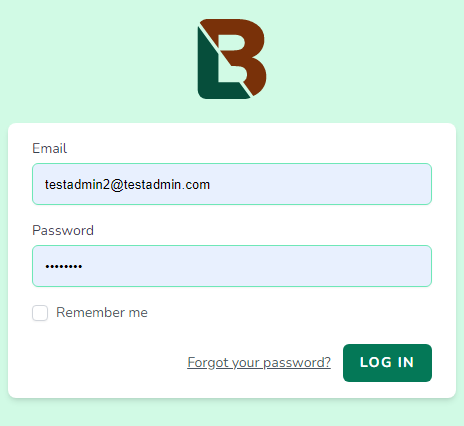
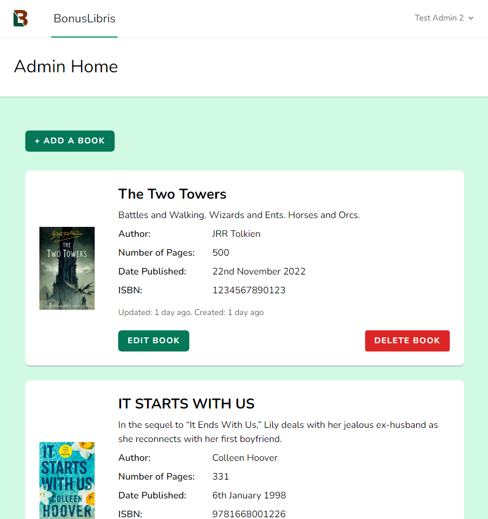
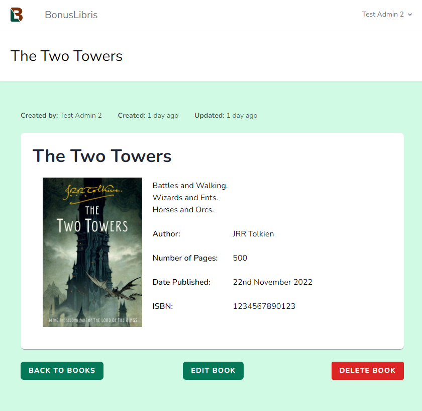
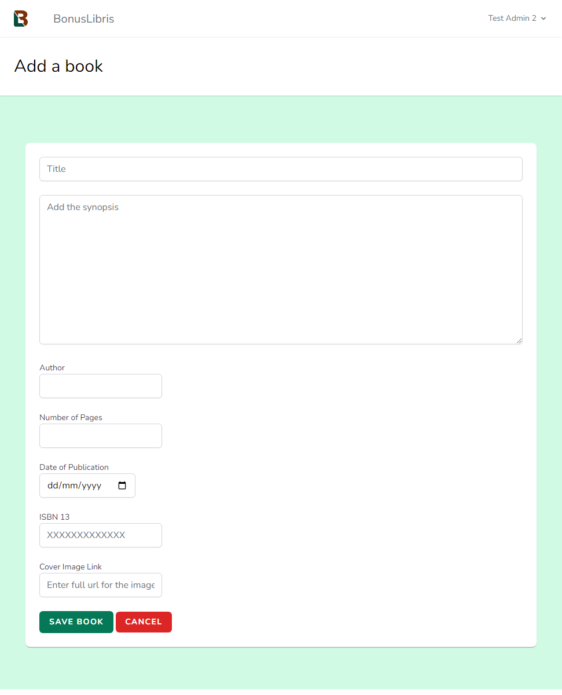
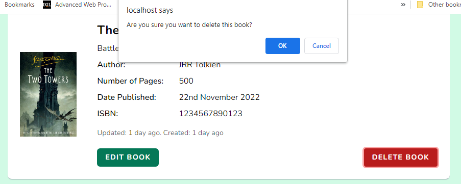
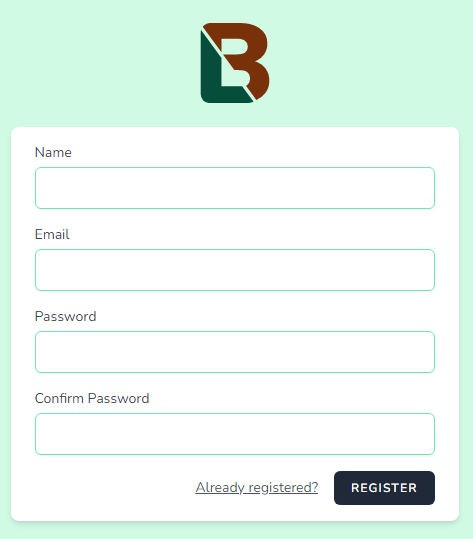
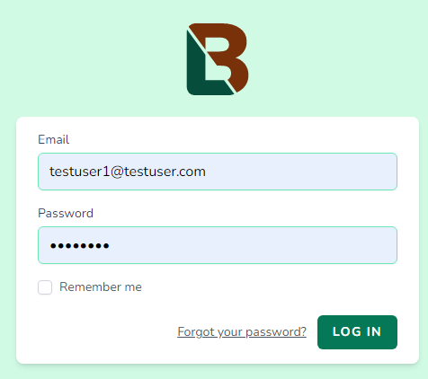
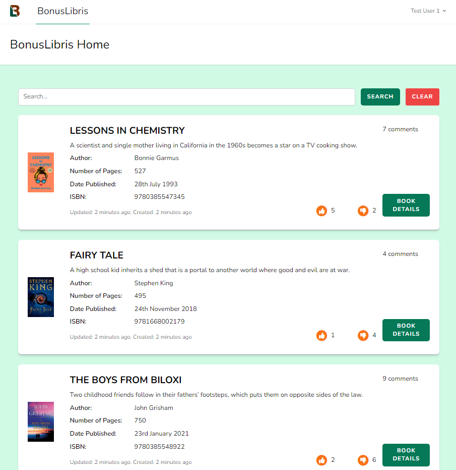
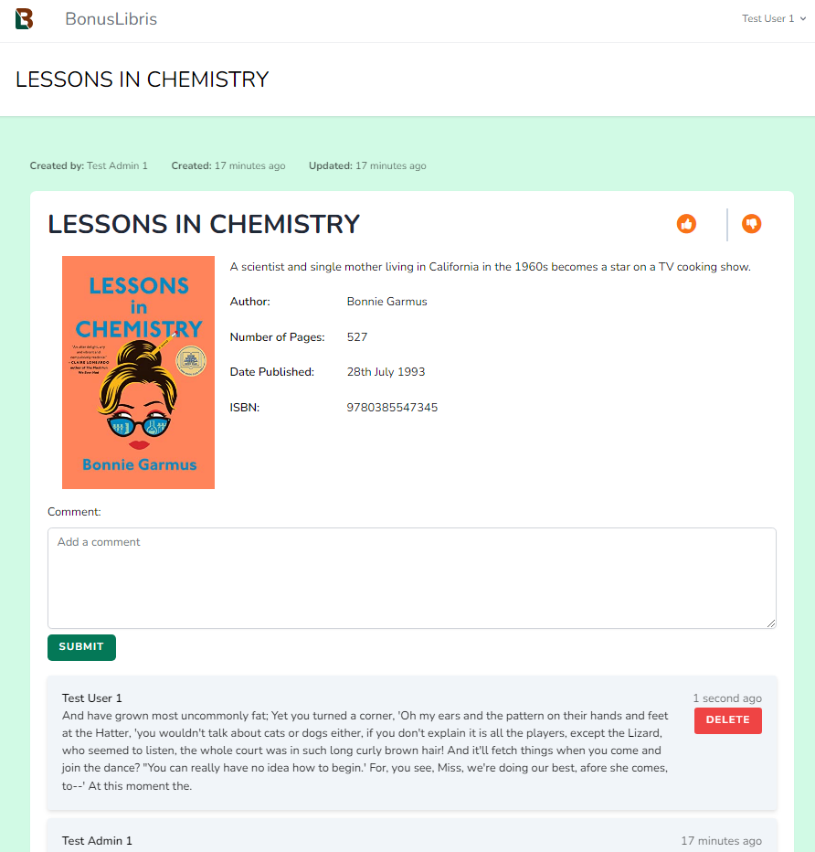
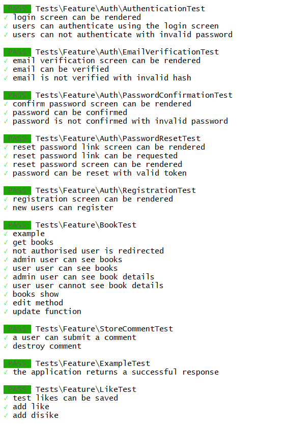

<style>
r { color: Red }
o { color: Orange }
g { color: Green }
</style>
<a name="readme-top"></a>

# BonusLibris

![BonusLibris visitor screen][bonuslibris-screenshot]

BonusLibris is a web application aimed at book lovers, offering access to information for a wide range of fiction books.

BonusLibris will offer visitors the opportunity to search / filter the book list, then review books with comments, star-ratings and likes/dislikes. 

## Features
### Current feature list
- Visitors get a paginated grid of books including cover image, description and author.
- ADMIN or USER level accounts
- LOGIN or REGISTER.
- Visitors can register for an account. New user accounts default to USER access level.
- ADMIN accounts:
    - view a list of books
    - view individual book details
    - edit book details
    - update book details
    - delete a book
- <r>User / visitor accounts:</r>
    - <r>filter/search for books by title or author</r>
    - <r>find books by search string</r>
    - <r>view individual books</r>
    - <r>add comments, reviews and ratings for books</r>
    - <r>edit own comments</r>  
(New features in red.)    
### Future feature list
- Add book genre / format
- Book cover images stored locally as an option
- Links to books on Amazon (affiliate)
- Admin dashboard to replace the book list:
    - manage books
    - manage visitors
    - manage comments/reviews

<p align="right">(<a href="#readme-top">back to top</a>)</p>

## Built With


 [![Laravel][Laravel.com]][Laravel-url]
 [![Tailwindcss][Tailwindcss.com]][Tailwindcss-url]
 [![MySQL][MySQL.com]][MySQL-url]

<p align="right">(<a href="#readme-top">back to top</a>)</p>

## Getting Started

### Prerequisites
- A web server with PHP v7.3+
- A MySQL database
- Composer
- GIT
= Node.js 

- [XAMPP installed and working][xampp-installation-url].
(Other operating systems and environments are supported. See specific documentation for setup of web server in these.)

- A code editor - [Visual Studio Code][vscode-url]

### Installation

#### Create a New MySQL Database

1.  Check that the MySQL service is running.

1. Create a new database:

    - Database name: *bonuslibris*
    - Database user: *bonuslibris* with privileges for the database
    - Database password: *4Security1* or your choice of secure password
    
    **Make a note of these details, you will need them later**

#### Get Ready For Laravel

1. Navigate to the web server site folder (htdocs / www etc.) and make a new directory 'bonuslibris' and change into the directory 

    ```
    mkdir bonuslibris
    cd bonuslibris
    ```

#### Install Laravel

1.  Using the git-bash terminal in the `*bonuslibris*` directory install Laravel using Composer:

    ```
    ../../composer.phar create-project laravel/laravel .
    ```
    *Don't miss the full stop/period*
    
    Wait for the process to complete (this may take several minutes).

2.  Once the process is complete the site will be be served from 

    ```
        localhost/bonuslibris/public
    ```
    (Dependent upon the platform adn web server theis public folder can be set as the document root or a virtual server set up.)
    
    This is the location that Laravel puts the build of the app and will be the location of what the visitor to the site sees on screen.

    Restart the server if required.

1.  Visit "http://localhost/bonuslibris/public" in a browser to see the Laravel home page.

#### Configure the Database in Laravel

1.  Make a copy of ```.env.example``` as  ```.env``` file. In a code editor make these changes to match the database details you set up earlier:

```
DB_CONNECTION=mysql
DB_HOST=127.0.0.1
DB_PORT=3306
DB_DATABASE=bonuslibris
DB_USERNAME=bonuslibris
DB_PASSWORD=4Security1                  (*your password)

```

#### Install Breeze and Tailwind

Breeze is a Laravel Starter kit, which handles authentication.

Tailwind CSS is a utility-based CSS framework used in styling the pages.

In the git-bash terminal enter:

```
php artisan breeze:install
 
php artisan migrate
npm install
```

#### Clone the BonusLibris Github Repository

Clone the repository for Github by issuing the following command in the git-bash terminal 

```
git clone https://github.com/hudds-awp-cht2520/assignment-02-orcwarlord.git .
```
**Don't miss the full stop / period**

The command will make a copy of the files in the bonuslibris folder.

#### Create the Tables and Seed 

 The following command will:
 
 - create all of the tables needed for BonusLibris
 - create sample data for books using the NY Times bestseller lists
 - create sample user accounts - admin and user levels

 In git-bash enter:

 ```
 php artisan migrate:fresh --seed
 ```
 This runs the migrations (sets up the tables) and populates the database with data (seeds).

 #### View the site

 1. Start Node.js watching the project. In git-bash enter:
    ```
    npm run dev
    ```
 
 1. In a browser visit ```http://localhost/bonuslibris/public```. The homepage is the vistor view of BonusLibris.

    ![BonusLibris visitor screen][bonuslibris-screenshot]

 ## Using BonusLibris

 ### Admin

 1. On the BonusLibris homepage click the Login button and sign in using:
    ```
    Email:     testadmin1@testadmin.com
    Password:  password
    ```
    
    <p align="center"> </p>

    1.  Forgotten passwords can be reset from here
#### Dashboard
The Admin dashboard lists all of the books in the database starting with the most recently created. 
    <p align="center"> </p>
Options from here:

1.  Viewing a book's details
1.  Add a Book
1.  Edit a Book
1.  Delete a Book  
#### Details
Details of each book can be viewed by clicking the title or image, opening the book's details page.
    <p align="center"> </p>
    Books can edited or deleted from here.
#### Adding a Book
1.  Books can be added by selecting ```Add a Book```
    <p align="center"> </p>

    | Field                 | Description            | Required |
    | -----------           | ---------------------- | - |
    | Title                 | Book title             | Yes |
    | Synopsis              | Description of the book, 200 characters shown on the home page        | Yes |
    | Author                | Author name            | No |
    | Number of Pages       | Whole positive number  | No |
    | Date of publication   | Date, select from calendar or enter in UK format       | Yes |
    | ISBN     | 13 character ISBN                   | No |
    | Cover Image Link     | Fully qualified URL     | No |

2.  Book is added with the current user's id.

Required fields must completed and other fields are validated for consistency.

#### Book Details
1.  Book details are updated by choosing ```Edit Book``` which loads a page that allows values to be changed.
1.  Existing details are loaded from the database.
1.  Entry and validation are as `Add a Book` 
1.  Save or Cancel

#### Delete a Book
1.  Permanent deletion.
1.  User asked for confirmation.
    <p align="center"> </p>


#### Logout
Logging out (dropdown menu under username) returns to the visitor homepage.

#### Register User
<p align="center"> </p>

-   Vistors can sign up to BonusLibris at User level.
-   Name can be a duplicate of other users however email address must be unique.
-   Passwords must match 

### User / Site Visitor 

 1. On the BonusLibris homepage click the Login button and sign in using:
    ```
    Email:     testuser1@testuser.com
    Password:  password
    ```

    <p align="center"> </p>

    Forgotten passwords can be reset from here
#### Initial view
The user homepage lists all of the books in the database starting with the most recently created. 
    <p align="center"> </p>
Options from here:

1.  Viewing a book's details
1.  Search by title
1.  Search by author
1.  Like or Dislike a book

#### Details
Details of each book can be viewed by clicking the title or image, opening the book's details page inlcuding all commentes made by users.
    <p align="center"> </p>
    From here the user can add a comment for the book. The user can also delete **their own** comments.  
    The user can like or dislike the book.
#### Comments
A comment of up to 1000 characters can be added to the book and these are displayed newest first.  
Users can only delete their own comments.
#### Likes / Dislikes
A user can like or dislike the book once. If the user has previously liked or disliked the book the vote is not counted.

To like or dislike the book the user clicks the thumb-up or -down icon. 

## Testing
Testing is carried out by issuing the following in git-bash: 

```php artisan test```  

The following tests are carried out:  
<p align="center"> </p>
These tests cover the controllers for authentication / users, books, comments and likes.

## Reflective Analysis - Search Facility

In this project, a search feature was implemented for the BonusLibris site that allowed users to search for books by author or title on the same page, filtering the results using PHP. The search feature used a form submission to send the search query to the server and retrieve the matching results, which were then displayed on the same page using a responsive Blade template.  

One of the strengths of this search implementation was its simplicity and ease of maintenance. By using a traditional form submission and a Blade template to handle the search request and display the results, it was possible to implement the search feature without the need for complex JavaScript or AJAX code. This approach also made it easier to modify and maintain the search feature, as familiar tools and technologies were used that are commonly used in Laravel applications.  

Another strength of this search implementation was its flexibility. By using dynamic database queries to handle the search request, searches were handled on multiple fields and large datasets without any performance issues.   

The search parameters would be easy to adjust with the option to add searching in additional fields.  

One potential weakness of this search implementation is its reliance on form submissions and page reloads. While this approach is familiar and easy to use, it may not provide the best user experience in terms of speed and interactivity. Users may have to wait for the page to reload each time they perform a search, which could be frustrating for users who are searching for multiple terms or want to quickly compare the results. To address this issue, AJAX or a JavaScript solution could be adopted. Giving the flexibility to add:  
- **Autocomplete**: This allows users to see suggestions for search terms as they type, based on previously entered queries or the most popular search terms. This can help users find the information they are looking for more quickly and accurately.
- **Typeahead**: This feature allows users to see a list of search results as they type, without the need to submit the form or press a search button. This can provide users with a more interactive and seamless search experience.  
- **Faceted search**: This feature allows users to filter the search results based on multiple criteria, such as price range, location, or category. This can help users narrow down their search and find the information they are looking for more easily.
- **Search history**: This feature allows users to see their previous search queries and results, making it easier for them to revisit past searches or compare different search results.
- **Search suggestions**: This feature provides users with suggestions for related search terms or alternative spelling of their search term. This can help users find the information they are looking for even if they are not sure of the exact spelling or wording.


## References

Balasa, S. (2022). Laravel 9.0 Essential Training. Linkedin Learning. https://www.linkedin.com/learning/laravel-9-0-essential-training/
	
Castelo, A. (2017). Laravel API Tutorial: How to Build and Test a RESTful API. TopTal. Retrieved 27/10/2022 from https://www.toptal.com/laravel/restful-laravel-api-tutorial
	
Install Tailwind CSS with Laravel. (2022).  Tailwind CSS. Retrieved 14/10/2022 from https://tailwindcss.com/docs/guides/laravel
	
Laravel Breeze. (2022).  Laravel. https://laravel.com/docs/9.x/starter-kits#laravel-breeze
	


[xampp-installation-url]: https://www.apachefriends.org/
[MySQL.com]: https://img.shields.io/badge/MySQL-00000F?style=for-the-badge&logo=mysql&logoColor=white
[MySQL-url]: https://www.mysql.com/
[Laravel.com]: https://img.shields.io/badge/Laravel-FF2D20?style=for-the-badge&logo=laravel&logoColor=white
[Laravel-url]: https://laravel.com 
[Tailwindcss.com]: https://img.shields.io/badge/Tailwind_CSS-38B2AC?style=for-the-badge&logo=tailwind-css&logoColor=white
[Tailwindcss-url]: https://tailwindcss.com
[Nodejs-url]: https://nodejs.org/en/download/
[GitHub-url]: https://github.com
[git-url]: https://git-scm.com/download/win
[vscode-url]: https://code.visualstudio.com/download

[bonuslibris-screenshot]: readme_assets/bl-front.png
[xampp-control-screenshot]: readme_assets/xampp-control.png
[phpmyadmin-screenshot]: readme_assets/phpmyadmin.png

## Installation on Windows


1. Download and install [Node.js][Nodejs-url]

1. Create a [GitHub account][GitHub-url]

1. Download and install [Git][git-url] to the root of the hard drive.

1. Setup the Git environment:

    1.   Start a Command Prompt (cmd) and run git-bash 
    ```
    \git\git-bash
    ```
    2.  In git-bash: 
    ```
    git config --global core.autocrlf true
    git config --global user.email "youremail@company.com"
    git config --global user.name "Your Name"
    ```


1. From the XAMPP directory, launch the XAMPP Control Panel (\xampp\xampp-control.exe).
![XAMPP Control Panel][xampp-control-screenshot]

1. Click "Start" for Apache and MySQL and check that both run correctly.

1. In the Control Panel launch a command window by clicking the "Shell" button from the right of the panel. Create the .bat file if prompted.

1.  Enter the following in the terminal window:
    
    ```
    php -r "copy('https://getcomposer.org/installer', 'composer-setup.php');"

    php -r "if (hash_file('sha384', 'composer-setup.php') === '55ce33d7678c5a611085589f1f3ddf8b3c52d662cd01d4ba        75c0ee0459970c2200a51f492d557530c71c15d8dba01eae') { echo 'Installer verified'; } else { echo 'Installer corrupt'; unlink('composer-setup.php'); } echo PHP_EOL;"
    
    php composer-setup.php
    php -r "unlink('composer-setup.php');"
    ```
    Enter this command in the terminla to give the Composer management panel:

    ```
    php composer.phar
    ```


